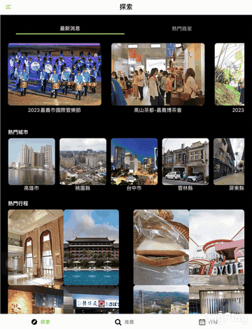
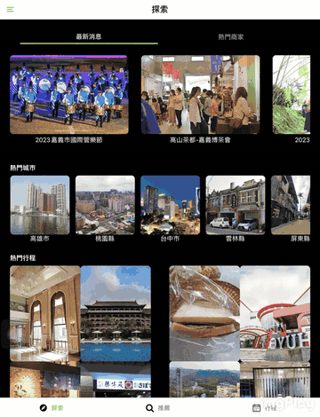
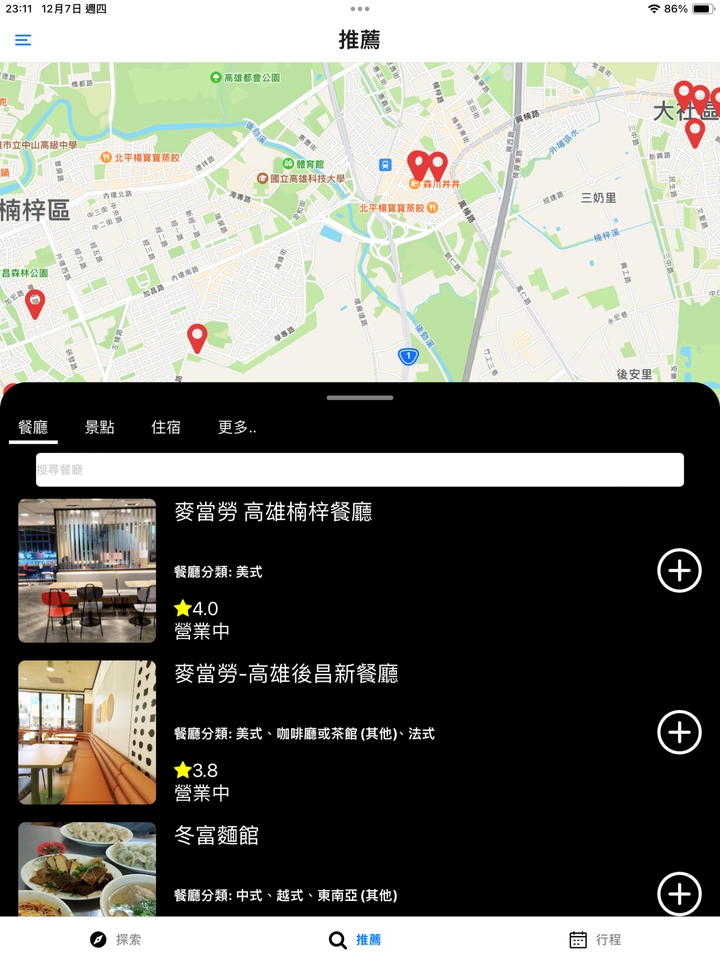
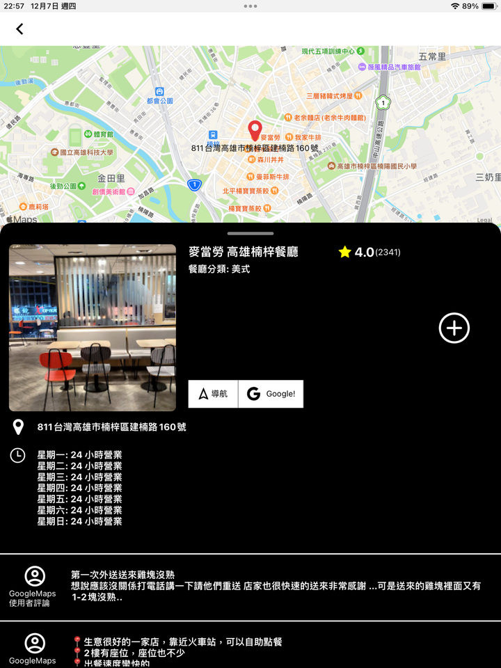
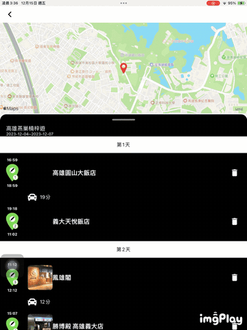
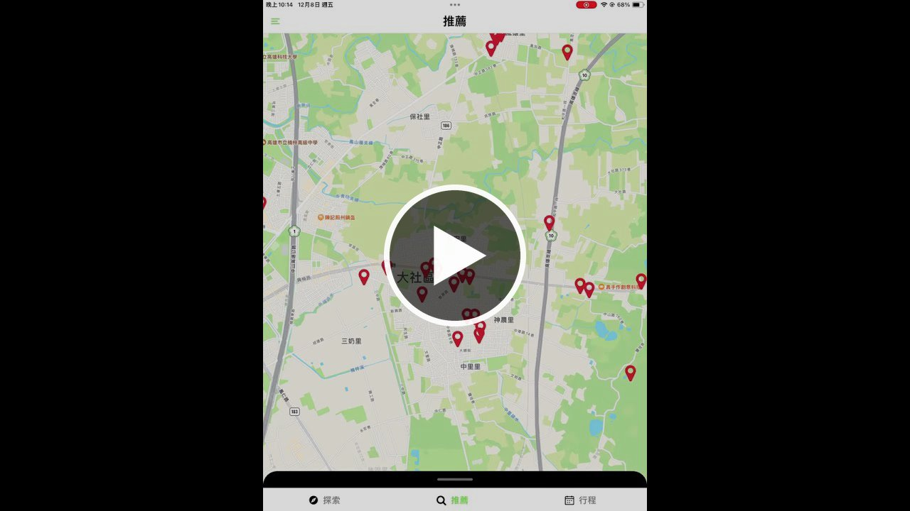
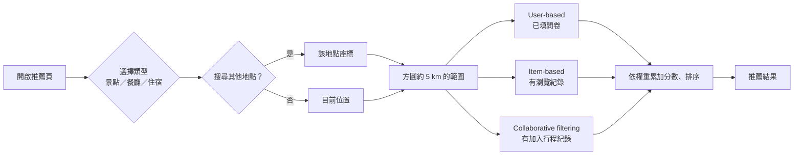
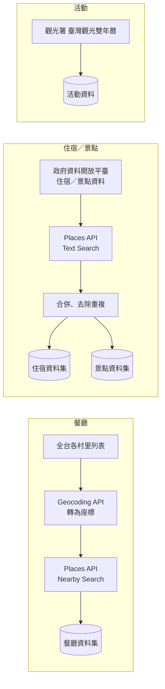

# MiTrip — 個人化旅遊行程推薦系統

> 國立高雄科技大學 智慧商務系 2023 實務專題（第十九組）　指導教授：廖奕雯 副教授

<table>
  <tr>
    <td align="center"><br>探索：最新消息／熱門城市</td>
    <td align="center"><br>探索：熱門行程</td>
    <td align="center"><br>推薦：地圖</td>
  </tr>
  <tr>
    <td align="center"><br>推薦：個人化清單</td>
    <td align="center"><br>地點詳細頁</td>
    <td align="center"><br>行程：拖曳編輯</td>
  </tr>
</table>

<sub>畫面為 2023 年專題發表時的版本（iPad 實機）。</sub>

### 功能介紹影片

[](https://www.youtube.com/watch?v=8dTCVhyDl4I)

<sub>點擊縮圖即可在 YouTube 觀看。</sub>

## 為什麼做 MiTrip

疫情限制鬆綁後旅遊需求回升，但多數人排行程時仍以社群軟體上的熱門打卡點為主，不一定符合自己的偏好與需求。MiTrip 以**基於內容的推薦**與**協同過濾**，依使用者的旅遊偏好推薦住宿、餐廳與景點，並提供行程規劃與分享，讓使用者在一個 App 裡完成「找地方 → 排行程」。

| | MiTrip | KKday | Funliday | 背包客棧 | TripAdvisor |
|---|:-:|:-:|:-:|:-:|:-:|
| 交通規劃 | ✓ | ✗ | ✓ | ✗ | ✓ |
| 整合移動服務 | ✓ | ✓ | ✗ | ✗ | ✗ |
| 旅記行程規劃分享 | ✓ | ✓ | ✓ | ✓ | ✓ |
| 景點住宿安排推薦 | ✓ | ✓ | ✓ | ✓ | ✓ |
| **使用者偏好推薦** | ✓ | ✗ | ✗ | ✗ | ✗ |

<sub>競品比較引自 2023 年專題計畫書。</sub>

## 功能

**探索**（開啟 App 的預設頁）
- 最新消息：即時取自觀光署網站
- 熱門商家、熱門城市：依使用者點擊次數排序
- 熱門行程：其他會員公開的行程，可直接參考

**推薦**
- 地圖模式：查看附近的景點／餐廳／住宿
- 將下方面板往上拉，可看到系統依個人偏好推薦的清單；可依評分、營業中篩選
- 詳細頁：評分、營業時間、評論（會員可評分與留言），附 Google 地圖連結，可查即時資訊

**行程**（需登入會員）
- 多日行程；拖曳調整站點順序，也可修改抵達／離開時間，或刪除站點
- 後端依站點間距離自動重排時間，並顯示交通時間
- 地圖上以連線顯示每日路線

**會員**
- 註冊、登入、修改密碼
- 首次登入填寫旅遊偏好問卷：旅遊類型（個人／情侶／家庭）、預算範圍、偏好的活動環境、餐廳口味、住宿與景點類型等

## 推薦系統

三種推薦方式依使用者目前有的資料啟用，候選地點都限定在目前位置（或搜尋地點）方圓約 5 公里內：

| 方法 | 啟用條件 | 做法 | 權重 |
|---|---|---|:-:|
| **User-based**（基於內容：使用者） | 已填偏好問卷 | 計算你與其他使用者的問卷相似度，取最相近的前 10% 使用者，將他們最常瀏覽的商家類別，結合你的問卷偏好，從附近挑出符合類別的地點 | 0.1 |
| **Item-based**（基於內容：物品） | 有瀏覽紀錄 | 以你最近瀏覽的商家為基準，用 TF-IDF 與餘弦相似度，比較評分、價位、類別、供餐時段等屬性，找出附近相近的地點 | 0.4 |
| **Collaborative filtering**（協同過濾） | 有加入行程的紀錄 | 以你最近加入行程或瀏覽的商家為基準，找出也加入過或瀏覽過這些商家的其他使用者，推薦他們行程裡、而你還沒加入或瀏覽過的附近地點 | 0.5 |

同一地點被多種方法推薦時，權重會累加，最後依總分排序。三種方法都還沒有資料可用時（例如剛註冊），會直接列出附近的地點。



**離線評估**：隨機抽出 30%（及 20%）的使用者，與其餘使用者計算相似度，取最相近 10% 使用者最喜歡的前 N 個商家類型作為推薦，檢查是否命中該使用者自己最喜歡的類型。依結果選定 Top-N：餐廳 N = 4、景點 N = 3、住宿 N = 3。

## 資料集



| 資料 | 來源 | 是否附在 repo |
|---|---|---|
| 餐廳、旅館、景點基本資料與照片 | Google Maps Places API | 否（Google 條款不允許再散布） |
| 旅館、景點補充資料 | 交通部觀光署（政府資料開放平臺） | 否（已與上列資料合併） |
| 村里列表 `data_collection/VOTROC.json` | 維基百科〈中華民國村里列表〉（CC BY-SA 4.0） | 是 |
| 旅遊偏好問卷 | 專題期間自行發放（175 份，已匿名化） | 否 |

## 架構

```
front/            Expo（React Native）App — SDK 57 / React Native 0.86 / React Navigation 7
backend/          Flask REST API（port 5000）
  recommendedSystem/  推薦演算法（userBase / itemBase / collaborativeFiltering）
  gettingData/        推薦、搜尋、詳細資料查詢
  memberSystem/       帳號、問卷、行程
db/               schema.sql（13 張表）、load_data.py（匯入地點資料）、seed_demo.py（示範資料）
data_collection/  當年蒐集資料用的腳本（Google Maps API、菜系分類等），App 執行時不需要
tools/            smoke_test.py（API 端到端測試）、create_demo_user.py、gen_art.py（產生 App 插圖）
```

## 從零建立開發環境

需要：Docker、Python 3.11、Node.js 20 以上，以及手機或平板上的 **Expo Go**（需支援 SDK 57）。

### 1. 資料庫

```bash
cp .env.example .env          # 填入 DB_PASSWORD、MYSQL_ROOT_PASSWORD
docker compose up -d          # MySQL 8；第一次啟動會自動套用 db/schema.sql
```

### 2. 後端

```bash
cd backend
pip install -r requirements.txt
python main.py                # http://0.0.0.0:5000（改完程式要手動重啟）
```

### 3. 匯入資料

地點資料不附在 repo 裡（見〈資料集〉）。請先把原始檔放到 `data_local/`，再執行：

```bash
python db/load_data.py        # 加 --limit N 可只匯入部分資料
python db/seed_demo.py        # 建立示範帳號與行程；可重複執行，會還原成初始狀態
```

示範帳號：`demo` / `mitrip-demo`

### 4. 前端

```bash
cd front
cp .env.example .env          # 把 EXPO_PUBLIC_API_URL 改成執行後端那台電腦的區網 IP
npm install
npx expo login                # SDK 57 的 Expo Go 要先登入，才能載入專案
npx expo start --lan
```

手機／平板要和電腦連同一個 Wi-Fi，再用 Expo Go 掃 QR code，或輸入 `exp://<電腦IP>:8081`。

### 5. 測試

```bash
python tools/smoke_test.py    # 後端要先啟動；會跑一遍 註冊→問卷→推薦→行程→評論 的完整流程
python db/seed_demo.py        # 測完後還原示範資料（會清掉 smoke test 建立的帳號）
```

## 組員與分工

| 姓名 | 負責項目 |
|---|---|
| 詹皇羿 | 環境建置、系統規劃、資料爬取、伺服器架設、後端實作 |
| 葉士維 | 資料爬取、後端實作、簡報製作 |
| 蔡閎宇 | 資料爬取、後端實作、海報設計、簡報製作 |
| 王泓尹 | UI 介面設計、前端實作、簡報製作、問卷製作 |
| 范鈞瑜 | UI 介面設計、前端實作、簡報製作、問卷製作 |

## 版本紀錄

- **2023**：專題原始版本（Expo SDK 49）
- **2026**：整理後公開
  - 把寫死在程式碼裡的帳密、金鑰和 IP 移到 `.env`
  - 原始資料庫沒有留下來，改從後端 SQL 反推 schema，並重寫資料匯入流程
  - 升級到 Expo SDK 57
  - 修正拖曳閃退、問卷重複填寫、中文欄位亂碼、交通時間計算等錯誤
  - 插圖改用 `tools/gen_art.py` 以程式繪製的原創圖片

## 授權

本專案程式碼以 [Apache License 2.0](LICENSE) 授權釋出。

不在此授權範圍內的有：
- 地點資料（Google Maps Places）本來就沒有附在 repo 裡
- `data_collection/VOTROC.json` 依維基百科原本的 CC BY-SA 4.0 授權
